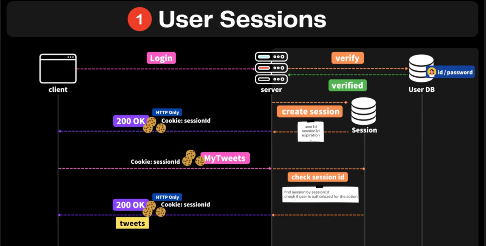
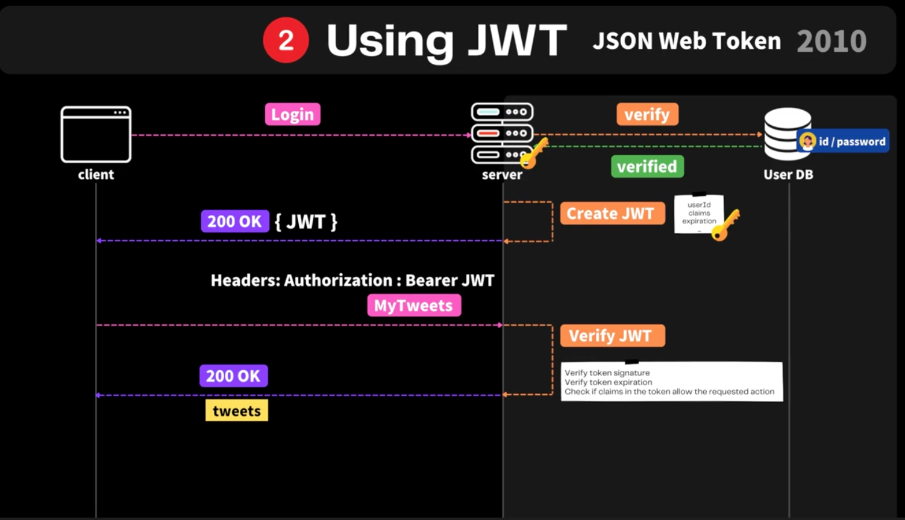

# Authentication

You are who you say you are

## Session과 Cookie를 이용하는 로그인 방법

1. 신뢰할 수 있는 데이터가 있다.
2. 클라이언트에서 별도 처리 없이 브라우저에서 처리가능
3. with http only option -> 보안성이 높다.
4. session ID에 대해서 보내므로 개인정보가 안전하다.

단점

1. Stateful하기 때문에 세션정보가 보관 된 곳이 DDOS에 취약하다

## JWT의 방법

JWT (Header ,Payload, signature로 구성) secret을 통해 정보의 유효성을 확인할 수 있다.

장점

1. 서버에 별도의 state가 없다.

단점

1. 서버와 클라이언트 간에 끊임없이 주고받기 때문에, 영원히 유효한 JWT를 해킹당하면 큰일난다.

- payload에는 정말 중요한 data만 넣는다 ( ex. userId, isAdmin)

> jwt.sign을 통해 token을 생성 ( expire 옵션등을 사용가능)
> jwt.verify를 통해 token의 유효성 검증 및 payload에 대해 검증 가능하다.

### JWT와 Session 중 JWT를 택한 이유

1. RESTful API Service as a backend
2. Usable by other services
3. Easy to scale horizontally

## BCrypt

해시함수를 이용해서 암호화 된 부분으로 암호를 저장하도록 한다.( salt 를 사용하여, table을 통해 알기 어렵도록 한다.)
