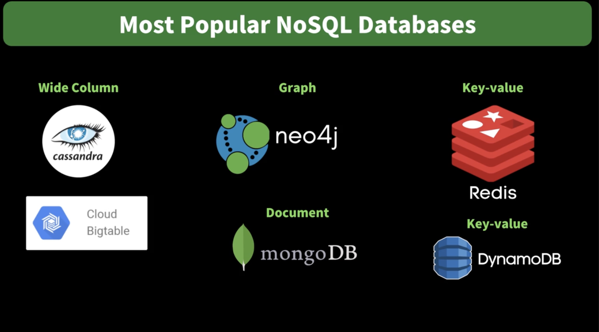

## What is a Database?

> **Organized collection of data**, generally stored and accessed electronically from a computer system.

** DBMS(Database Management System) **
ex. Oracle, MySQL, MongoDB

- optimised for data storage & retrieval
- handles complex data
- concurrent access
- data security
- ~~complex itself~~

SQL
기본적으로 RDBMS: 관계를 정의하는 (FROM, WHERE 등 기본적인 DB)

NoSQL
관계가 없는 Database (Ex. Key-value, document, wide-column, Graph)

** Difference를 알고, 사용에 맞춰서 사용할 줄 알아야 한다 **

### SQL Database

** Tables of rows and columns **

> 행마다 특정 데이터 타입, 속성을 지정해야한다
> Table, column, row 특징을 SCHEMA
> SCHEMA: Data integrity를 보장한다(다른 속성, 다른 타입의 데이터를 넣을 수 없기 때문)
> Primary Key:
> Foreign Key : 관계를 정의
> SQL Query( SELECT, FROM, WHERE )
> ex. Oracle, SQL Server, SQLite ,MySQL, PostgreSQL

### NoSQL

Why?

1. to solve "impedance mismatch" problem
2. Big data sparked growth of NoSQL DB adoption

특징

1. Schema-less
2. Non-relational, hence cluster-friendly
3. Address specific problem
ex. Key-Value, Document, Wide-column, Graph **MongoDB**

#### MongoDB
- Primary unit of data is a document
- Documents organised in collections
- self-contained
- Data duplication instead of relation
- 개발자가 DB를 잘 관리해야한다 (schema가 없기 때문에)

### ORM vs ODM

* ORM ? Object Relational Mapping
Code를 DB로 변환할 때 어떻게 변환할 것인지 대신 해주는 것

1. Run the Code
2. CreatesDB Table
3. Creates the record

Pros
1. Business Logic
2. No Boilerplate cod
3. Database Abstraction (다른 SQL Database를 사용 가능)
4. Schema migration

Cons
1. SQL Knowledge로 상세한 query 불가
2. SQL Knowledge가 없어서 효율적인 query 불가
3. Complex Queries는 불가
4. 빠른 성능, 메모리 최적화는 아쉽다

Ex. TYPEORM, Sequelize, Prizma

* ODM(Object Document Mapper)

Ex MongoDB에서 사용하는 mongoose를 말한(Document 형식의 Database로 변경)

### SQL vs NoSQL

1. 어떤 데이터 타입을 저장하는지?
2. 얼마나 많은 Data를 저장할 것인가?
3. 관계가 있는지?

* SQL
>Accounting Soft
>E-commerce platforms
>customer Relationship software(CRM)

* NosQL
>Social Networks(Graph)
>Distributed cache(key-value)
>content Management Systems(Document)
>Real-time analytics(wide-column)

* Hybrid approach
>User service: MonoDB
>Billing Service: MySQL
>Transcoding Service: DynamoDB