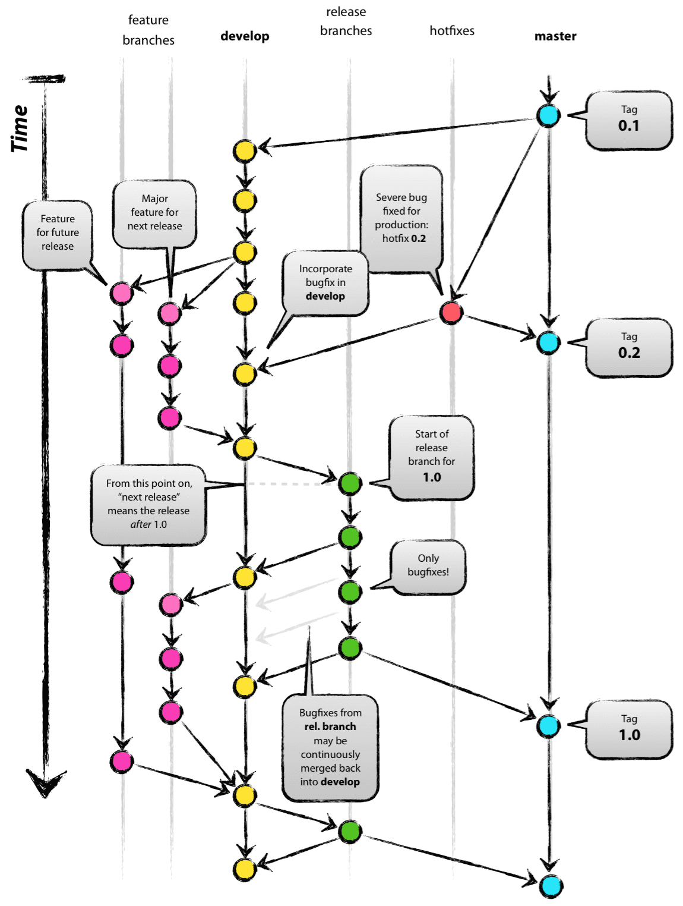
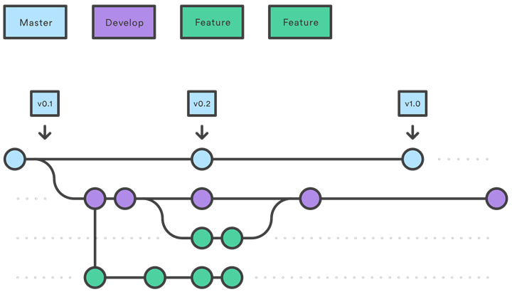
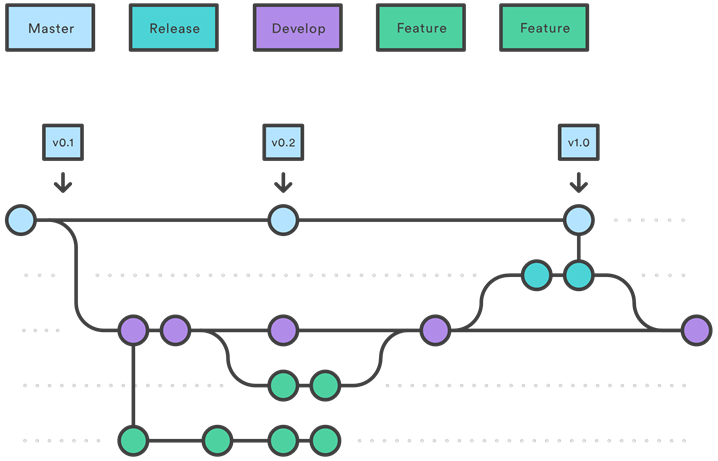
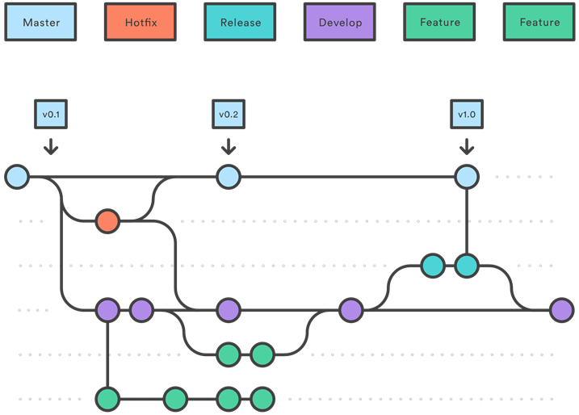

# Git-Flow

## Git 브랜치 전략

- main branch(master, develop)
- 필요시 생성 브랜치(feature-, hotfix-, release / improvement, bugfix-) 

master: 배포가능한 상태만을 관리하는 브랜치
develop: 다음에 배포할 것을 개발하는 브랜치

- 보조브랜치: 피처브랜치(feature branch) or 토픽 브랜치(topic branch)
  보통 개발자 저장소에만 있는 브랜치로 origin에 push하지는 않음

feature/#이슈번호 와 같은 형태로 브랜치를 관리한다

- 릴리즈 브랜치: 배포를 위한 최종적인 버그 수정 등의 개발을 수행
- 핫픽스 브랜치: 배포한 버전에서 긴급하게 수정할 필요가 있을때 master 에서 분리하는 브랜치 -

## 좋은 커밋메시지 작성법

### 커밋 유형 지정

- FEAT: 새로운 기능의 추가
- FIX : 버그 수정
- DOCS : 문서수정
- STYLE : 스타일 관련기능 (코드 포맷팅, 세미콜론 누락, 코드자체의 변경이 없는경우)
- REFACTOR: 코드 리펙토링
- TEST: 테스트코드, 리펙토링 테스트 코드 추가
- CHORE: 빌드 업무 수정, 패키지 매니저 수정 (ex. gitignore 수정 같은 경우)

### 제목과 본문을 빈행으로 분리

- 편집기를 사용해서 진행하자 [깃 커밋 에디터 사용법]("https://richone.tistory.com/27")

### 제목은 50자로 제한

- 쉽고 간결하게 표현하자

### 제목 행의 첫글자는 대문자

### 제목 행 끝에 마침표를 넣지 않는다

### 제목 행은 항상 병령문

### 본문은 72자마다 줄 변경

### 본문에는 변경한 내용, 이유를 설명 (무엇을? 왜?)

### 문제가 무엇인지도 설명한다(기본적으로 이해를 하고 있다는 없다)

### 자신의 코드가 직관적이고, 누구나 보면 알 수있다고 생각하지 말자

### 팀에서 정한 Commit 규칙을 따르고, 없다면 만들자

> Git Commit Message 작성시 참고자료
> [Git Directory]("https://blog.ull.im/engineering/2019/03/10/logs-on-git.html")
